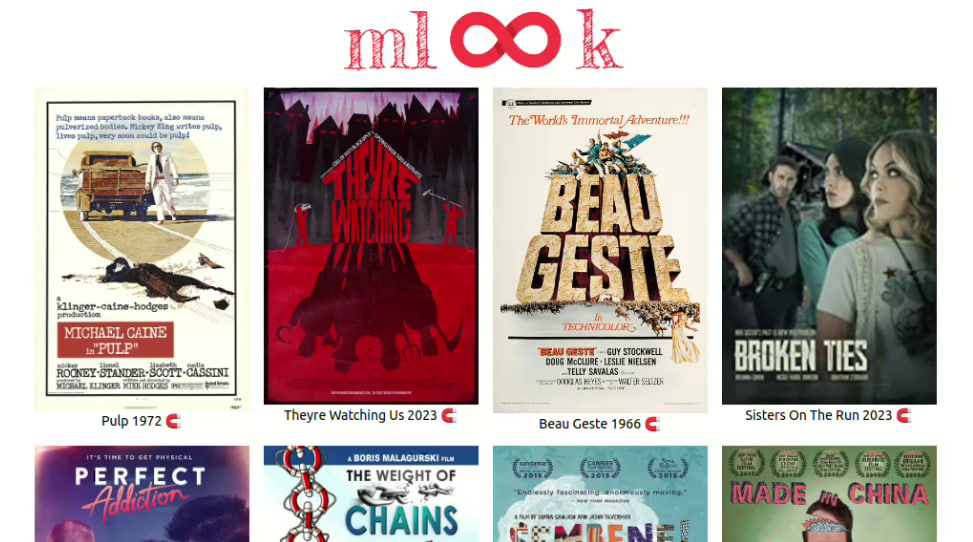

# mlook

**M**ovies look - a web app for chosing movies available at torrent trackers by looking at posters

<p align="center">
    
</p>

## Deployment

The app can be deployed using github codespaces or manually. The first approach is preferable because it allows to access torrent trackers which may be blocked in your country.

### Codespaces

To deploy the app using `github codespaces`, you can use two scripts:

1. Start a codespace associated with the project and execute `remote` script inside it:

```sh
gh cs start
./tools/setup/cs/remote.sh
```

2. Forward ports from codespace to your local device:

```sh
./tools/setup/cs/local.sh zeionara-codespace-name-fjdkjslkdjfoiejf
```

3. Open the web page `http://localhost:3000` in browser and wait until the first batch of movies is ready. To get more movies scroll to the bottom of the list.

### Manual

The app consists of two components that should be deployed separately. First, deploy server using the following commands:

```sh
cd server
python -m server start
```

Then deploy client:

```sh
cd client
npm run serve
```

The app will be accessible by address `http://localhost:3000`
